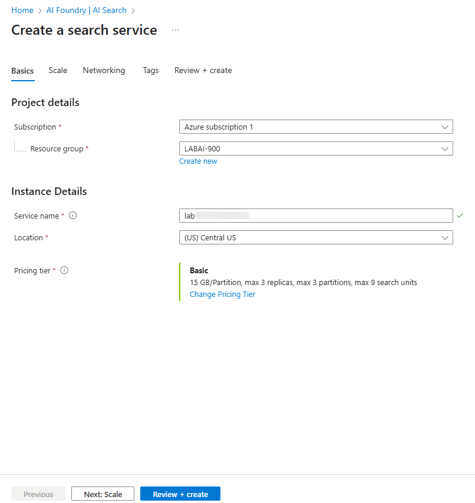
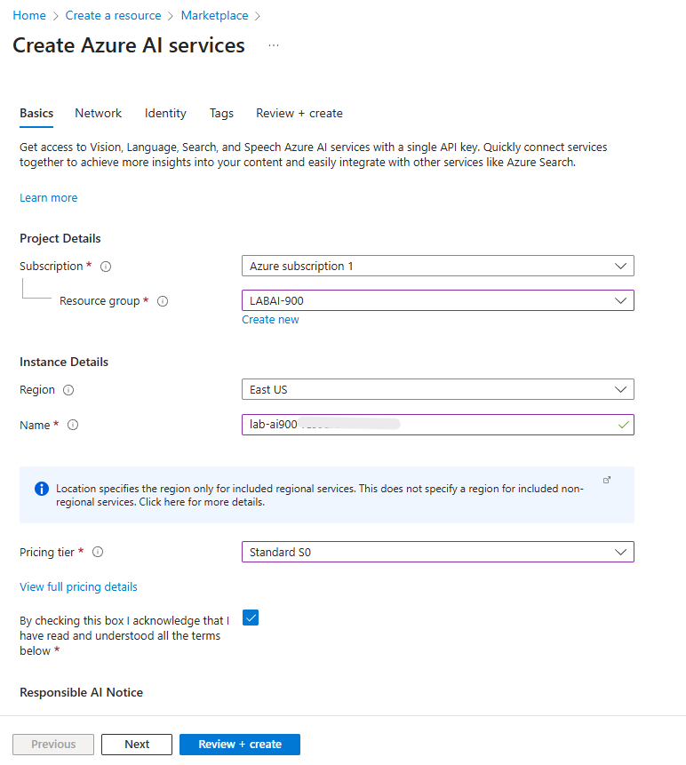
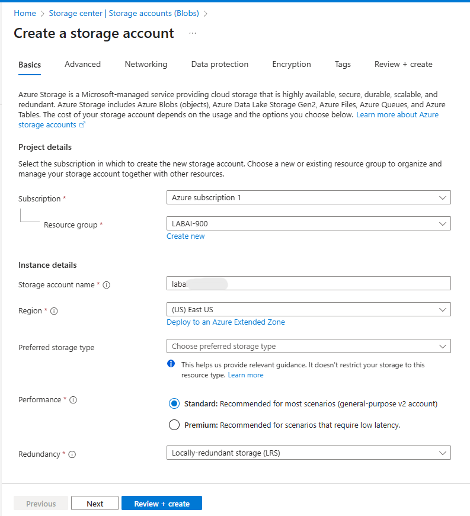
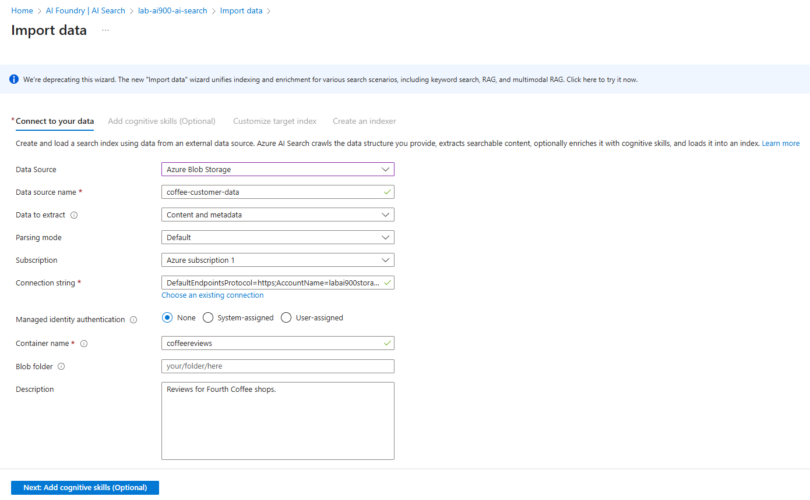
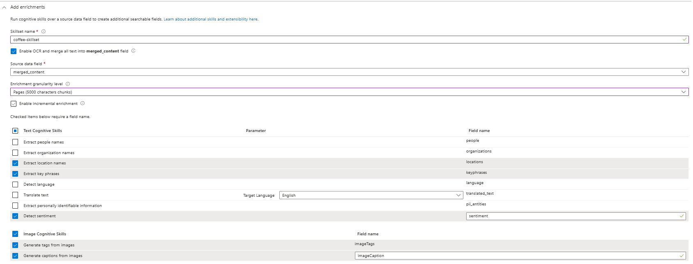
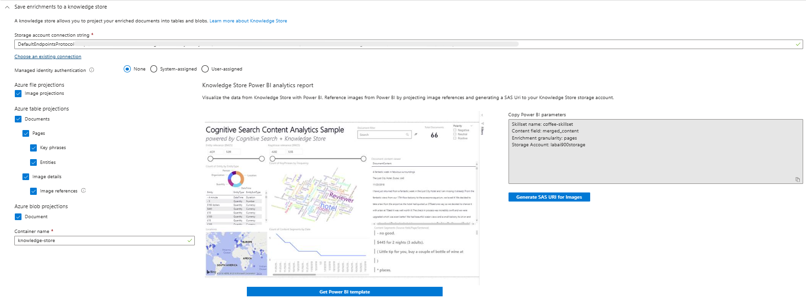
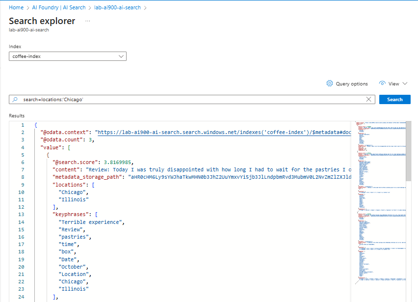

# **LAB 04: Azure Cognitive Search: Utilizando AI Search para indexação e consulta de Dados**

Neste laboratório, é imaginado que você trabalha para a **Fourth Coffee**, uma rede nacional de cafeterias. A sua missão é ajudar a construir uma **solução de mineração de conhecimento** que facilite a **busca por informações e insights sobre as experiências dos clientes**.

Para isso, você vai criar um **índice do Azure AI Search**, utilizando **dados extraídos de avaliações de clientes**, permitindo que a empresa possa **analisar comentários e descobrir padrões ou opiniões importantes** de forma rápida e inteligente.


Será necessário dos seguintes recursos:

* **Azure AI Search** - gerencia indexação e consultas.
* **Azure AI services** - fornece os serviços de IA usados pelas *skills* (enriquecimentos).
* **Storage Account com containers Blob** - armazena os documentos brutos e as projeções do *knowledge store*.

---

## 1. Criar um recurso Azure AI Search

1. Faça login no Portal Azure.
2. Clique em **+ Criar um recurso**, pesquise por **Azure AI Search** e preencha:

   * **Subscription**: sua assinatura.
   * **Resource group**: crie ou selecione um existente.
   * **Service name**: nome único para o serviço.
   * **Location**: *East US 2* ou *Central US*
   * **Pricing tier**: *Basic*.
3. Clique em **Revisar + criar** e depois **Criar**. Aguarde a implantação.
4. Após o deploy, selecione **Go to resource** para abrir a página do Azure AI Search. ([web.archive.org][1])



---

## 2. Criar um recurso Azure AI Services

1. No portal do Azure, clique em **+ Criar um recurso** e pesquise **Azure AI services**.
2. Configure com:

   * **Subscription**: mesma assinatura.
   * **Resource group**: **mesmo** grupo do Azure AI Search.
   * **Region**: **mesma** região do Azure AI Search.
   * **Name**: nome único.
   * **Pricing tier**: *Standard S0*.
3. **Revisar + criar** → **Criar**. Aguarde o deploy.



---

## 3. Criar uma Storage Account (contêiner de blobs)

1. No portal do Azure, clique em **+ Criar um recurso** → **Storage account**.
2. Preencha:

   * **Subscription**: sua assinatura.
   * **Resource group**: mesmo do Search e AI services.
   * **Storage account name**: nome único.
   * **Location**: mesma região dos serviços anteriores.
   * **Performance**: Standard.
   * **Redundancy**: LRS (Local Redundant Storage).
3. Crie o recurso e depois, no painel da Storage Account, vá em **Configuration** (under Settings).
4. Altere **Allow Blob anonymous access** para **Enabled** e salve.

   * Isso facilita testes com o import wizard; em produção, prefira conexões protegidas e permissões mais restritas.

**Atenção:** habilitar acesso anônimo é aceitável para labs/demos; nunca deixe dados sensíveis assim em produção.



---

## 4. Fazer upload dos documentos para o Storage (container)

1. Na Storage Account, abra **Containers**.
2. Clique em **+ Container** e crie:

   * **Name**: `coffee-reviews`
   * **Public access level**: *Container (anonymous read access for containers and blobs)*
3. Baixe e extraia o ZIP de avaliações: `storage/reviews.zip`.
4. Entre no container `coffee-reviews` e clique em **Upload** → **Select a file**. Selecione todos os arquivos da pasta e **Upload**.
5. Ao final, os documentos estarão no container e prontos para indexação.

---

## 5. Indexar os documentos

Use o **Import data** do Azure AI Search para criar automaticamente Data Source, Skillset, Index e Indexer:

1. No recurso **Azure AI Search**, clique em **Import data**.
    * 
2. **Connect to your data**: selecione **Azure Blob Storage** e preencha:

   * **Data source name**: `coffee-customer-data`
   * **Data to extract**: *Content and metadata*
   * **Parsing mode**: *Default*
   * **Connection string**: escolha **Choose an existing connection** → selecione sua Storage Account → selecione o container `coffee-reviews` → **Select**.
   * **Description**: `Reviews for Fourth Coffee shops.`
3. Clique **Next: Add cognitive skills (Optional)**.
4. **Attach AI Services**: selecione o recurso **Azure AI services** que você criou.
5. **Add enrichments**, configure o *skillset* (alterar o nome para `coffee-skillset`) e selecionar as opções:
   * **Enable OCR** e mesclar texto em `merged_content`
   * **Enrichment granularity level**: *Pages* (chunks de 5000 caracteres).
   * Não habilitar *incremental enrichment*.
   * Selecione os *enriched fields* (ex.: `locations`, `keyphrases`, `sentiment`, `imageTags`, `imageCaption`).
   * Exemplos mapeados:
     * Extract location names → `locations`
     * Extract key phrases → `keyphrases`
     * Detect sentiment → `sentiment`
     * Generate tags from images → `imageTags`
     * Generate captions from images → `imageCaption`
     * 
6. **Save enrichments to a knowledge store**: marque projeções e entidades que deseja persistir (ex.: Image projections, Documents, Pages, Key phrases, Entities, Image details, Image references).

   * Quando solicitado, escolha a Storage Account e crie um container novo chamado `knowledge-store` com **privacy level = Private**.
   * 
7. Clique **Next: Customize target index**:

   * **Index name**: `coffee-index`
   * **Key**: `metadata_storage_path` (chave que identifica cada documento)
   * Marque como **filterable** os campos recomendados (content, locations, keyphrases, sentiment, merged_content, text, layoutText, imageTags, imageCaption).
8. **Next: Create an indexer**:

   * **Indexer name**: `coffee-indexer`
   * **Schedule**: *Once* (ou configure recorrência se desejar).
   * Em **Advanced options**, marque **Base-64 Encode Keys** (ajuda performance/eficiência do indexer).
9. **Submit** - o wizard cria: data source, skillset, index e indexer; o indexer é executado automaticamente, executando o pipeline:

   * extrai metadata e conteúdo;
   * executa skills de IA que geram campos enriquecidos;
   * mapeia campos enriquecidos para o índice.

**Observações técnicas sobre skillsets / enrichments**

* **OCR** (Enable OCR): essencial quando há imagens embutidas em documentos ou PDFs que contêm texto; sem ele muitos campos enriquecidos não aparecem.
* **Granularity = Pages**: processa texto por páginas/blocos para capturar mais contexto.
* **Knowledge Store**: armazena projeções e tabelas dos dados enriquecidos (útil para análises posteriores sem consultar o índice diretamente).

---

## 6. Verificar o status do indexer

1. No recurso Azure AI Search → **Indexers** (Search Management).
2. Selecione `coffee-indexer`. Aguarde e atualize (**Refresh**) até o **Status** indicar **success**.
3. Clique no nome do indexer para ver detalhes de execução, documentos processados e possíveis erros.

---

## 7. Consultar o índice (Search explorer)

Use o **Search explorer** para validar resultados e testar queries:

1. Na página Overview do serviço de Search, clique **Search explorer**.
2. Verifique se o índice selecionado é `coffee-index`. Mude para **JSON view**.
3. No editor JSON, cole a query para retornar todos os documentos:

```json
{
    "search": "*",
    "count": true
}
```

Clique **Search** — você verá o retorno em JSON com `@odata.count`.

4. Filtrar por local (ex.: Chicago):

```json
{
  "search": "locations:'Chicago'",
  "count": true
}
```



Execute **Search** → deve retornar `@odata.count` igual a `3` (conforme dataset do lab).
5. Filtrar por sentimento negativo:

```json
{
  "search": "sentiment:'negative'",
  "count": true
}
```

Execute **Search** → deve retornar `@odata.count` igual a `1`.

> Observe que os resultados são ordenados por `@search.score` - a pontuação que indica relevância em relação à query.

---

## Conclusão

Seguindo esses passos teremos completo: *documentos brutos* → *enriquecimento por IA (OCR, sentimento, key phrases, tags de imagem, captions)* → *índice de busca pesquisável* → *knowledge store* com projeções persistidas. Essa arquitetura é útil para criar soluções de **knowledge mining**, análise de feedback de clientes e painéis analíticos que combinam busca e insights gerados por IA.

---