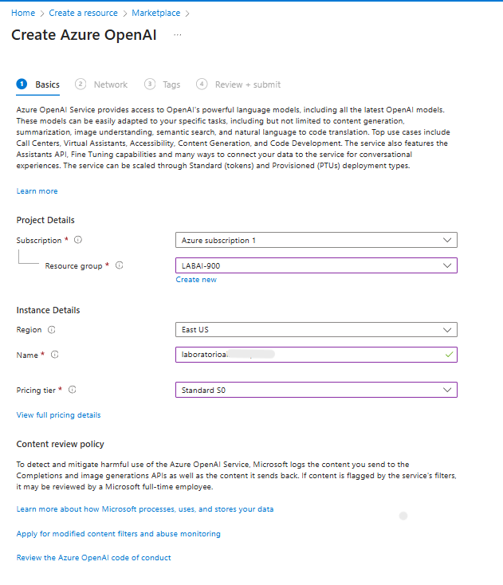
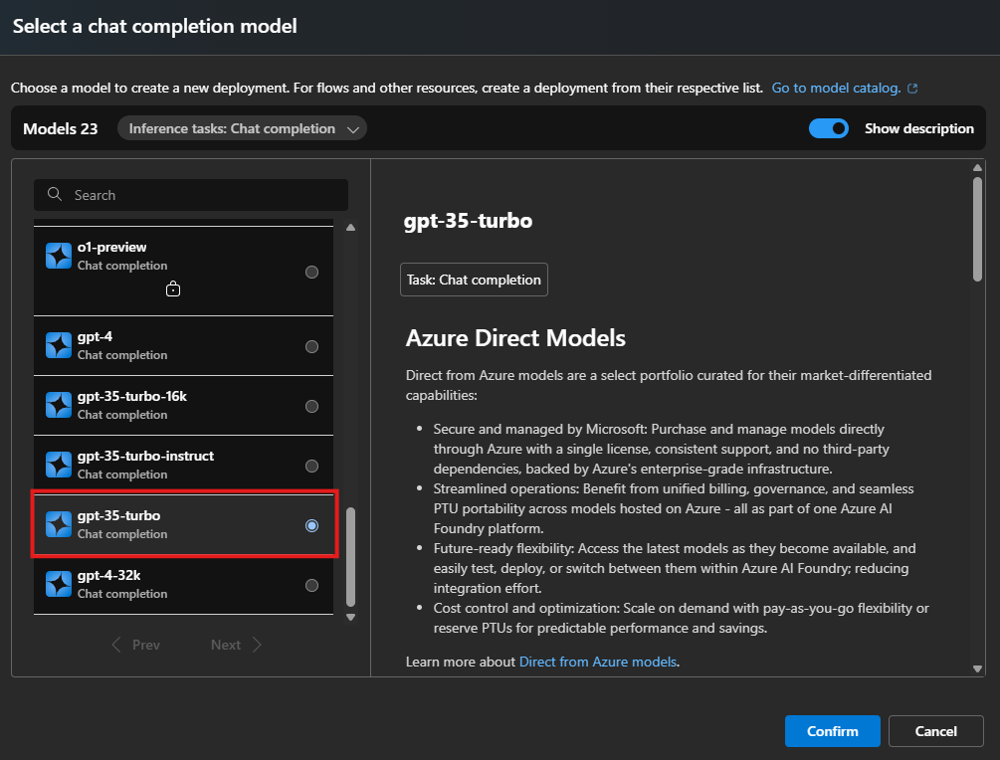
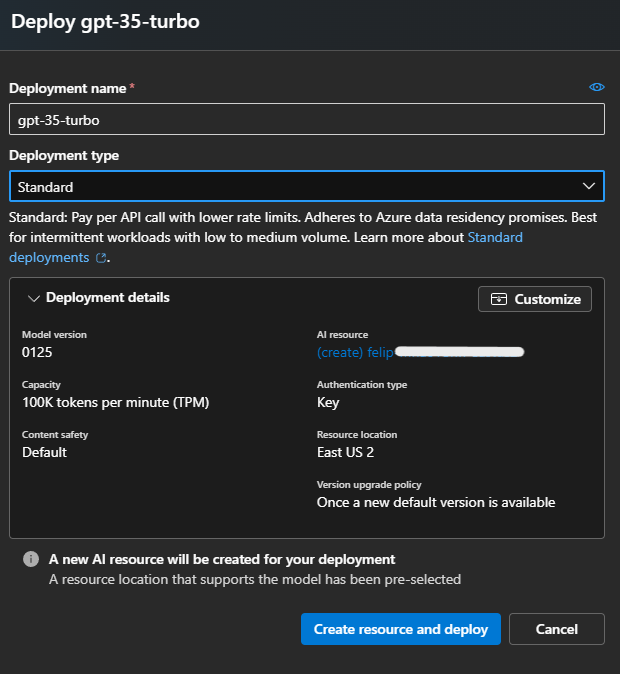
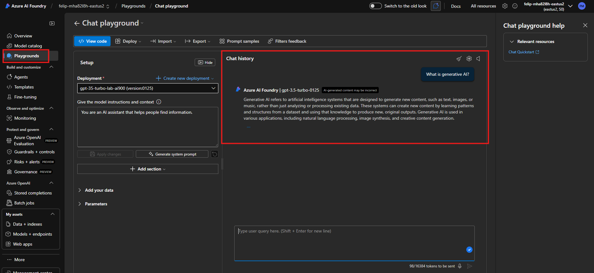

# LAB 05: Explorando os Recursos de IA Generativa com Copilot e OpenAI

O **Azure OpenAI Service** traz os modelos de IA generativa desenvolvidos pela OpenAI para a plataforma Azure, permitindo desenvolver soluções de IA poderosas que se beneficiam da segurança, escalabilidade e integração dos serviços do Azure. Neste exercício vamos explorar o Azure OpenAI Service e usá-lo para implantar e experimentar modelos de IA generativa.

---

## Provisionar um recurso Azure OpenAI

Antes de poder usar modelos do Azure OpenAI, você deve provisionar um **recurso Azure OpenAI** em sua assinatura do Azure:

1. Entre no Portal do Azure.
2. Crie um recurso **Azure OpenAI** com as seguintes configurações:
   * **Subscription:** uma assinatura Azure aprovada para acesso ao Azure OpenAI.
   * **Resource group:** escolha um grupo existente ou crie um novo.
   * **Region:** **East US***
   * **Name:** um nome único à sua escolha
   * **Pricing tier:** **Standard S0**
3. Aguarde o deploy completar e, em seguida, acesse o recurso Azure OpenAI implantado no Portal do Azure.

---

## Explorar o Azure OpenAI Studio

Podemos implantar, gerenciar e explorar modelos neste recurso do Azure OpenAI usando o **Azure OpenAI Studio**.

1. Na página Overview do recurso Azure OpenAI, botão **Explore** para abrir o Azure OpenAI Studio em uma nova aba, ou acesse o **Azure OpenAI Studio** diretamente.
2. Ao abrir o Studio pela primeira vez, a interface exibe um painel lateral com páginas para navegar. Entre as funcionalidades disponíveis estão:

   * Experimentar modelos em um *playground*.
   * Gerenciar implantações de modelos e dados.

---

## Implantar um modelo para geração de linguagem

Para experimentar geração de linguagem natural, precisamos **implantar um modelo**:

1. Na página **Models** do seu recurso Azure OpenAI, visualize os modelos disponíveis.
2. Selecione qualquer modelo **gpt-35-turbo** cujo status **Deployable** esteja como **Yes**, e clique em **Deploy**.
3. Crie uma nova implantação com as configurações:

   * **Model:** `gpt-35-turbo`
   * **Model version:** Auto-update to default
   * **Deployment name:** um nome único para a implantação
   * **Advanced options:**
     * **Content filter:** Default
     * **Deployment type:** Standard
     * **Tokens per minute rate limit:** **5K***
     * **Enable dynamic quota:** Enabled

---

## Usar o Chat playground para trabalhar com o modelo

Com o modelo implantado, você pode testá-lo no **Chat playground**:

1. No **Azure OpenAI Studio**, navegue até o **Chat playground** no painel esquerdo.
2. No painel **Configuration**, verifique se sua implantação está selecionada.
3. No painel **Assistant setup**, selecione o template **Default system message** e visualize a mensagem do sistema, essa mensagem define o comportamento do modelo na sessão.
4. Na seção da sessão de chat, envie mensagens e veja o retorno:

