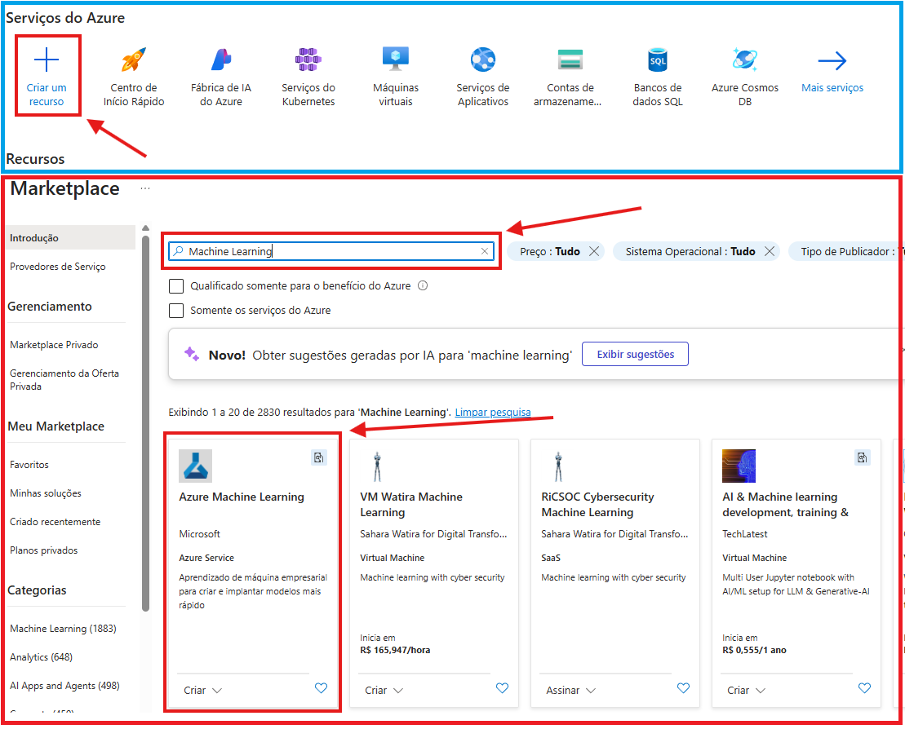
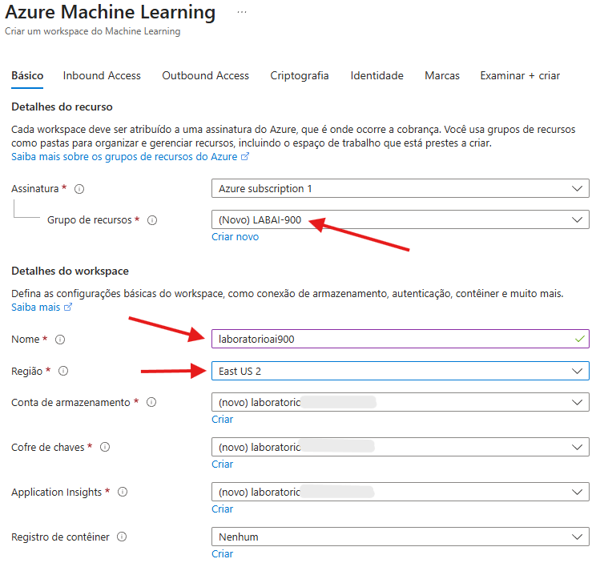
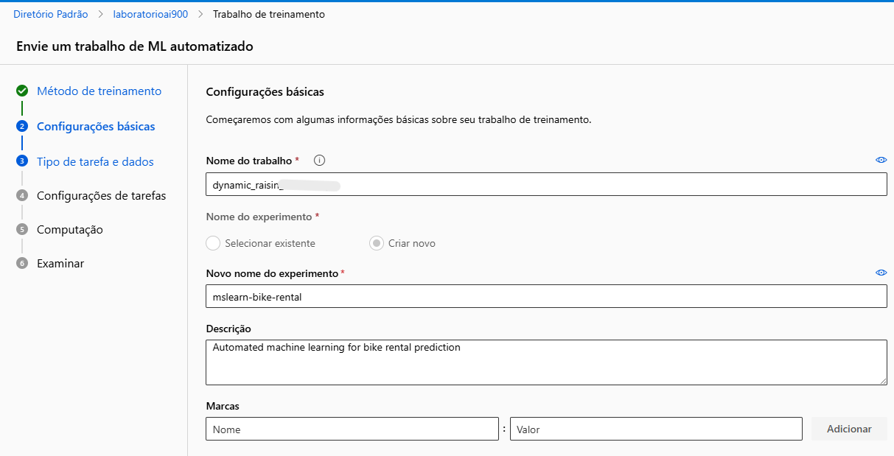
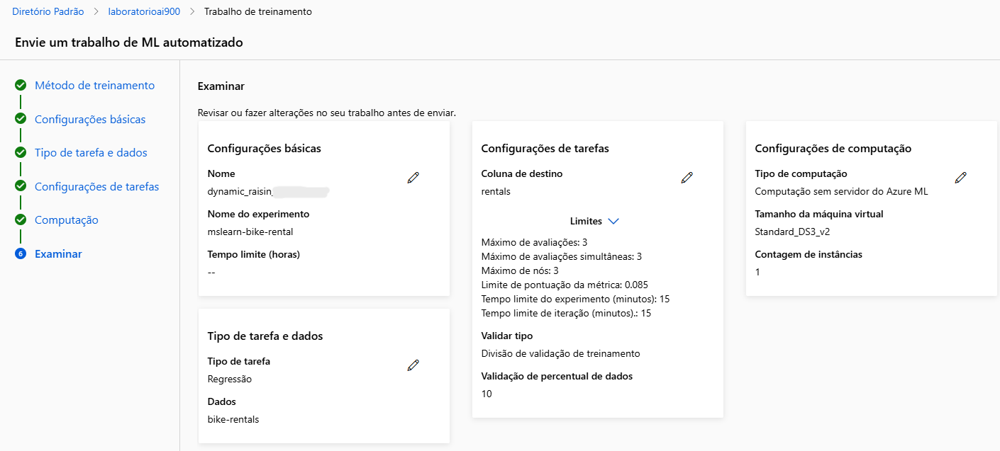
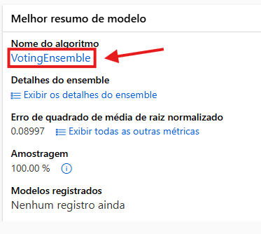
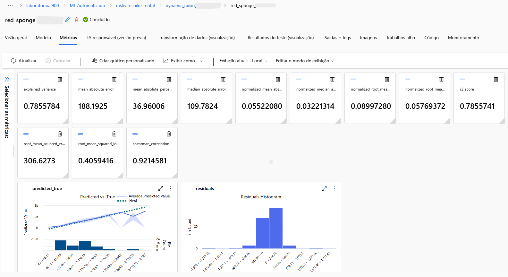
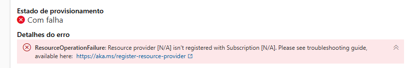
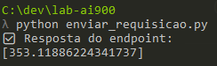

# LAB 01: Trabalhando com Machine Learning na Prática no Azure ML

Neste laboratorio, foi utilizado o recurso de *Machine Learning Automatizado* do Azure Machine Learning.

No meu laboratório descrito abaixo, você vai encontrar:

1. O passo a passo completo do laboratório feito via interface do Azure, configurações da maquina, modelo e testes.
2. Um script em Python consumindo a API do recurso, criado por mim para simular uma aplicação real interagindo com o serviço.

---

## 1. Criando o Workspace do Azure Machine Learning

1. Acessar o portal do Azure em `https://portal.azure.com`.

2. Clique em **+ Criar um recurso** e pesquise por “Machine Learning”:
   

3. Iniciar a criação do recurso **Azure Machine Learning** com as seguintes configurações:

    * **Assinatura**: assinatura do Azure
    * **Grupo de recursos**: criar um novo ou selecionar um já existente
    * **Nome**: escolher um nome único para o workspace
    * **Região**: *East US*
    * **Conta de armazenamento**: criada automaticamente
    * **Cofre de chaves**: criado automaticamente
    * **Application Insights**: criado automaticamente
    * **Registro de contêiner**: selecione “Nenhum”

   

4. Clique em **Revisar + Criar** e depois em **Criar**. O provisionamento pode levar alguns minutos.

5. Quando estiver pronto, selecione **Iniciar o Estúdio** ou acesse `https://ml.azure.com` em uma nova guia.

6. Caso o workspace não apareça automaticamente, vá em **Todos os workspaces** no menu lateral e selecione o que acabou de criar.

> 💡 Dica: se for apenas um laboratório, você pode deixar o projeto público (desde que os dados não sejam sensíveis). Em ambientes reais, sempre configure o acesso de forma privada, essas configurações adicionais são feitas nas outras abas visíveis no print acima.

---

## 2. Treinando um Modelo com Machine Learning Automatizado

Agora vamos usar o recurso de *ML Automatizado* para testar diferentes algoritmos, parâmetros e encontrar o melhor modelo.
O conjunto de dados utilizado contém informações históricas de aluguel de bicicletas, e o objetivo é prever o número de aluguéis por dia com base em variáveis sazonais e meteorológicas.

1. No Estúdio do Azure ML, vá até **ML Automatizado (em Criação)**.

2. Crie um novo trabalho com as configurações abaixo (vá clicando em *Avançar* conforme necessário):

   

    * **Nome do trabalho**: `mslearn-bike-automl`

    * **Nome do experimento**: `mslearn-bike-rental`

    * **Descrição**: “machine learning automatizado para previsão de aluguel de bicicletas”
   
    * **Marcas**: nenhuma

    * **Tipo de tarefa**: *Regressão*

    * **Conjunto de dados**: crie um novo com as seguintes informações:

        * Nome: `bike-rentals`
        * Fonte: *Arquivos da Web*
        * URL: `https://aka.ms/bike-rentals`
        * Tipo: *Tabela* (mltable)
        * Formato de arquivo: *delimitado*
        * Delimitador: vírgula
        * Codificação: UTF-8
        * Cabeçalhos: “somente o primeiro arquivo tem cabeçalhos”
        * Ignorar linhas: nenhum
        * O conjunto de dados contém dados multilinhas: não selecione
        * Esquema:
          * incluir todas as colunas que não sejam Caminho
          * Examinar os tipos detectados automaticamente

    * Após criar, selecione o conjunto de dados `bike-rentals`.

3. Configure o trabalho de treinamento:

    * **Tipo de tarefa**: `regressão`
    * **Conjunto de dados**: `bike-rentals`
    * **Coluna-alvo**: `alugueis` (inteiro)
    * **Métrica primária**: *Erro quadrático médio da raiz normalizada*
    * **Explicar o melhor modelo**: *não selecionado*
    * **Usar todos os modelos com suporte**: *Não selecionado.*
    * **Modelos permitidos**: selecione apenas **RandomForest** e **LightGBM**
    * **Limites avançados**:

        * Avaliações máximas: 3
        * Máximo de avaliações simultâneas: 3
        * Máximo de nós: 3
        * Limite de pontuação da métrica: 0,85
        * Tempo limite total: 15
        * Tempo limite por iteração: 5
        * Encerramento antecipado: habilitado
    * **Validação e teste**:

        * Tipo: *divisão de validação de treinamento*
        * Percentual de validação: 10
    * **Computação**:

        * Tipo: *sem servidor (serverless)*
        * Tipo de máquina virtual: CPU
        * Camada da máquina virtual: dedicada
        * VM: *Standard_DS3_V2*
        * Instâncias: 1

4. Envie o trabalho de treinamento e aguarde sua conclusão.



---

## 3. Analisando o Melhor Modelo

Depois que o treinamento for concluído, é hora de ver qual modelo teve o melhor desempenho.

1. Vá até a guia **Visão geral** do trabalho automatizado e observe o resumo do melhor modelo.
   
2. Clique no nome do algoritmo para ver os detalhes.
3. Na aba **Métricas**, ative os gráficos *residual* e *predicted_true* se ainda não estiverem selecionados.

    * O gráfico **residual** mostra a diferença entre os valores previstos e os reais.
    * O gráfico **predicted_true** compara o valor previsto com o valor real.

   

---

## 4. Implantando e Testando o Modelo

### Implantando o modelo

1. No melhor modelo (dentro do trabalho de ML automatizado), clique em **Implantar** e selecione **Serviço Web**.

2. Use as configurações abaixo:

    * Nome: `predict-rentals`
    * Descrição: “prever aluguéis de bicicleta”
    * Tipo de computação: *Instância de Contêiner do Azure*
    * Habilitar autenticação: **Sim**

3. Aguarde o início da implantação, isso pode levar alguns segundos. O Status do endpoint `predict-rentals` será exibido como “Em execução”.

4. Espere até que o Status de implantação mude para “Bem-sucedida”. Isso pode levar de 5 a 10 minutos.

> ⚠️ Se você encontrar o erro mostrado abaixo, siga estes passos para corrigir:
>
> 1. Vá até o **Portal do Azure**
> 2. Acesse **Assinaturas** → **Configurações** → **Provedores de Recursos**
> 3. Registre **Microsoft.PolicyInsights** e **Microsoft.Cdn**
> 4. Depois, atualize e tente novamente no ML Studio
>
> 

---

### Testando o serviço implantado

1. No Azure ML Studio, vá até **Pontos de Extremidade** e abra o endpoint `predict-rentals`.

2. Selecione a guia **Teste**.

3. Substitua o JSON padrão pelo exemplo abaixo:

   ```json
   {
     "Inputs": {
       "data": [
         {
           "day": 1,
           "mnth": 1,
           "year": 2022,
           "season": 2,
           "holiday": 0,
           "weekday": 1,
           "workingday": 1,
           "weathersit": 2,
           "temp": 0.3,
           "atemp": 0.3,
           "hum": 0.3,
           "windspeed": 0.3
         }
       ]
     },
     "GlobalParameters": 1.0
   }
   ```

4. Clique em **Testar** e aguarde o resultado:

   ```json
   [
      353.11886224341737
   ]
   ```

Isso significa que o modelo previu cerca de **353 aluguéis** para os parâmetros informados.

---

## 5. Testando via Script Python

Criei também um script Python para simular uma aplicação real consumindo o endpoint do Azure ML.
A ideia é testar a comunicação com o serviço e verificar se ele responde corretamente.

Claro, em um caso de uso real seria necessário adaptar algumas coisas:

* Gerar o *payload* dinamicamente, de acordo com os dados do usuário.
* Armazenar a **URL** e a **API Key** em um arquivo `.env` para manter as credenciais seguras.

Antes de rodar o script, certifique-se de que o Python está configurado corretamente.
Depois, basta executar o comando:

```bash
python bike_rental.py
```
Resultado:



O resultado exibido foi o mesmo do teste via interface, **353.11886224341737**, visto que usei  os mesmos dados de entrada.

Em um cenário real, uma aplicação se comunicaria com esse serviço, que por sua vez chamaria o modelo de IA do Azure e retornaria o resultado com base nas variáveis enviadas (como mês, dia e ano).

> Obs: o nome do script no print é diferente porque renomeei depois, para ficar mais condizente com o serviço.

---
